# Галерея дашборда Grafana

[English version](GRAFANA_GALLERY.md)

Все 11 разделов production-дашборда сняты с опубликованного образа `1.11.0` на детерминированном
синтетическом лабораторном SIP/RTP-трафике. Необязательные панели показывают `No data`, если
профиль не создаёт соответствующий сигнал, например endpoint-отчёты RTCP или ошибки парсинга;
это не ошибка запроса.

## Обзор

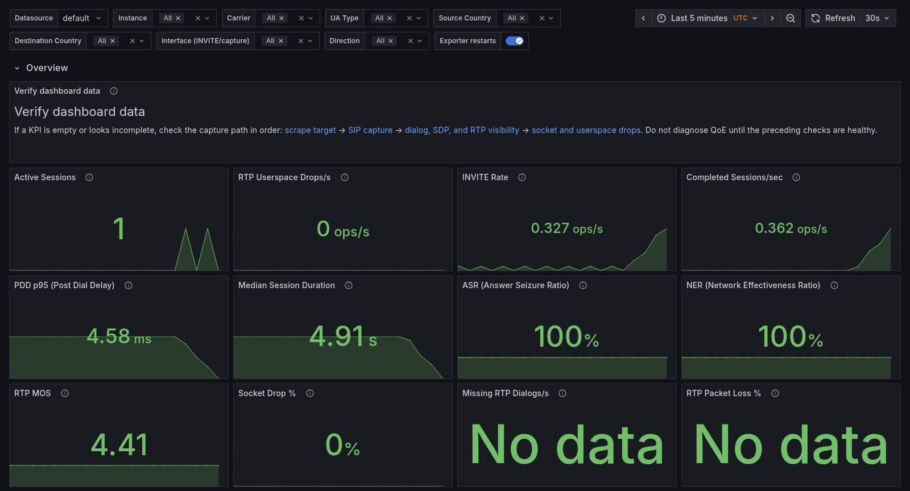

## SIP-трафик

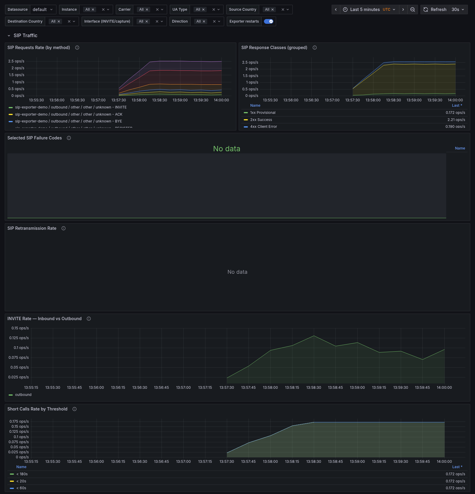

## Анализ RTP-медиа

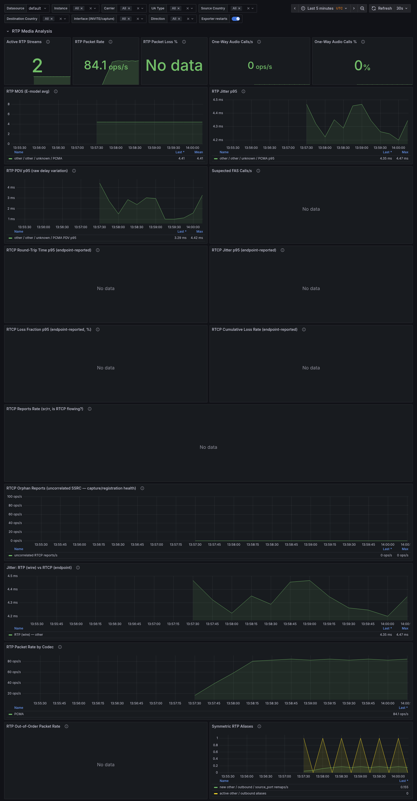

## Состояние системы

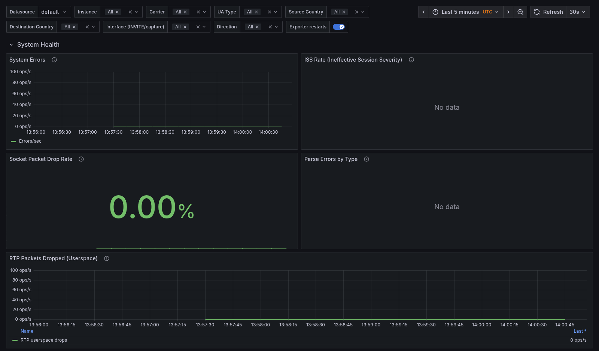

## Показатели RFC 6076

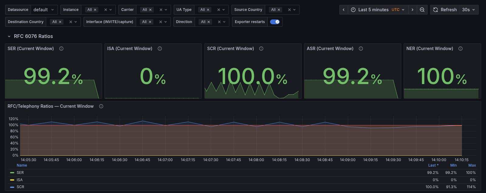

## Гистограммы задержек

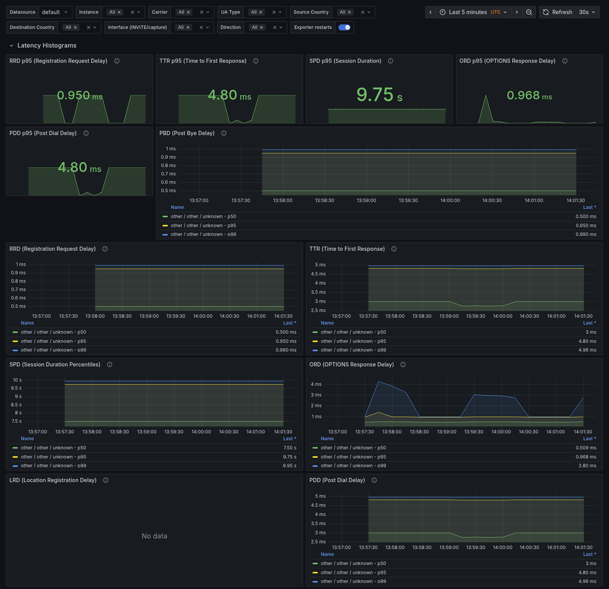

## Качество голоса (RFC 6035)

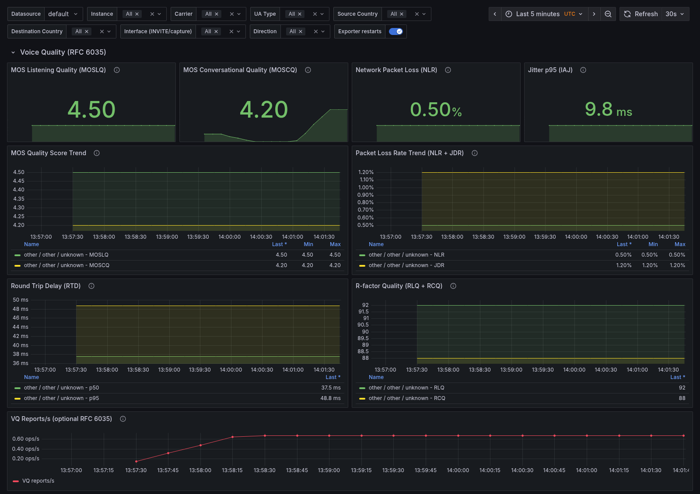

## Регистрации

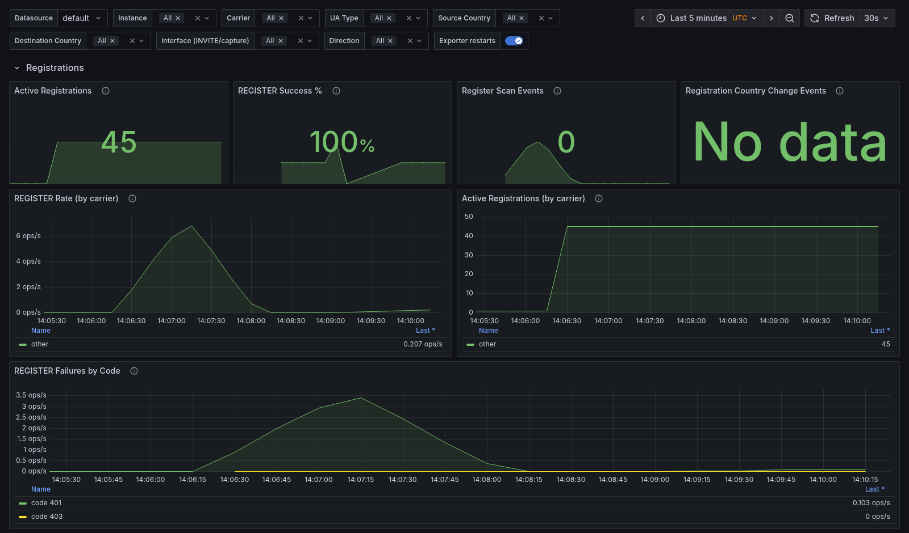

## Минуты трафика

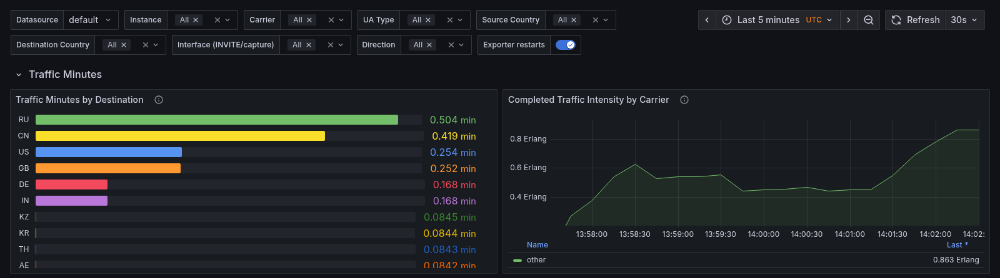

## Географическое распределение

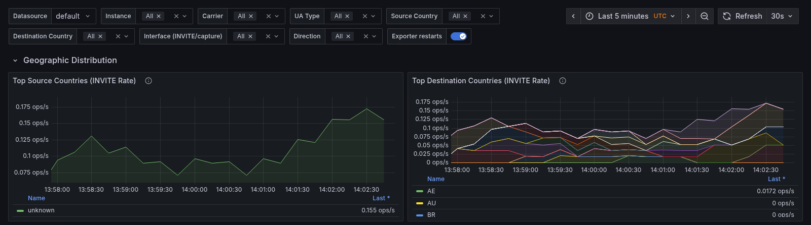

## Несколько сетевых интерфейсов

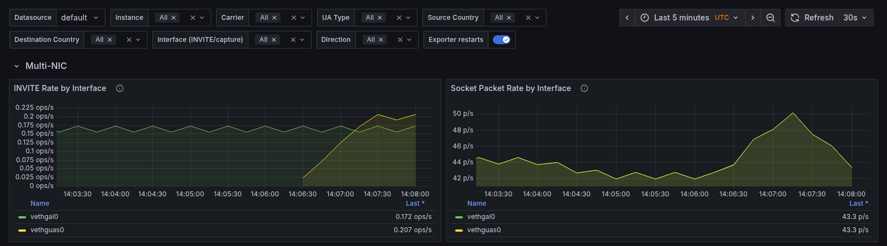
